# Documento de Arquitectura de Software (SAD) - Sistema EVA (Cafetería Dante)

**Versión:** 3.0 (Alineado a SRS Oficial)
**Fecha:** Mayo 2026

---

## 1. INTRODUCCIÓN

### 1.1. Propósito (Diagrama 4+1)
El propósito de este Documento de Arquitectura de Software (SAD) es proporcionar una visión arquitectónica global del sistema **EVA (Sistema Web para la Cafetería Dante)**. Se utilizará el modelo de vistas 4+1 de Kruchten para describir los aspectos fundamentales del diseño de software desde distintas perspectivas: lógica, desarrollo, procesos, física y la vista de casos de uso que unifica el modelo.

### 1.2. Alcance
Este documento aborda la arquitectura del sistema enfocado en la gestión de insumos, inventario y pasarela de pagos del Punto de Venta (POS). EVA es un sistema full-stack compuesto por un backend en Laravel (API REST) y un frontend en Next.js (React). Abarca 11 procesos críticos definidos en el flujo de negocio, sin contemplar la gestión de comandas o pantallas de cocina (KDS).

### 1.3. Definición, siglas y abreviaturas
* **API:** Interfaz de Programación de Aplicaciones.
* **EVA:** Nombre en clave del proyecto de gestión de la Cafetería Dante.
* **JWT / Sanctum:** Mecanismo de autenticación mediante tokens seguros.
* **POS:** Point of Sale (Punto de Venta).
* **QA:** Atributos de Calidad (Quality Attributes).

### 1.4. Organización del documento
El documento está organizado en cuatro secciones principales: (1) Introducción al sistema, (2) Objetivos y restricciones que guían el diseño, (3) Representación de las 5 vistas arquitectónicas mediante diagramas UML y (4) Evaluación de los atributos de calidad requeridos.

---

## 2. OBJETIVOS Y RESTRICCIONES ARQUITECTÓNICAS

### 2.1.1. Requerimientos Funcionales
El sistema se compone de 11 casos de uso fundamentales que actúan como los requerimientos funcionales principales:

**Módulo 1: Autenticación y Usuarios**
* **UC-001:** Autenticar Usuario.
* **UC-002:** Gestionar Personal y Roles.

**Módulo 2: Catálogos y Preparación**
* **UC-003:** Gestionar Catálogo de Productos.
* **UC-004:** Administrar Recetas de Productos.

**Módulo 3: Inventario y Kardex**
* **UC-005:** Gestionar Almacén de Insumos.
* **UC-006:** Registrar Entrada de Insumos.
* **UC-007:** Registrar Mermas Manualmente.

**Módulo 4: Punto de Venta (POS)**
* **UC-008:** Registrar Venta de Productos (Efectivo).
* **UC-009:** Procesar Pago con PayPal.
* **UC-010:** Emitir Comprobante de Venta.

**Módulo 5: Analítica y Reportes**
* **UC-011:** Consultar Dashboard e Informes.

### 2.1.2. Requerimientos No Funcionales – Atributos de Calidad
* **RNF-001 (Rendimiento):** El sistema POS debe procesar una venta y actualizar el inventario en tiempos mínimos, utilizando caché para los productos más solicitados.
* **RNF-002 (Usabilidad):** El sistema debe ser intuitivo y minimizar el impacto de los errores de los usuarios en el registro de inventario.
* **RNF-003 (Confiabilidad):** Transaccionalidad garantizada en base de datos. Movimientos inmutables en el Kardex.

### 2.2. Restricciones
* **Tecnológicas:** Obligatorio el uso de Laravel para Backend y Next.js para Frontend.
* **Infraestructura:** Despliegue en servidores estandarizados con bases de datos MySQL/MariaDB.

---

## 3. REPRESENTACIÓN DE LA ARQUITECTURA DEL SISTEMA

### 3.1. Vista de Caso de uso
Describe las funcionalidades centrales del sistema completo desde la perspectiva de sus actores oficiales.

#### 3.1.1. Diagramas de Casos de uso
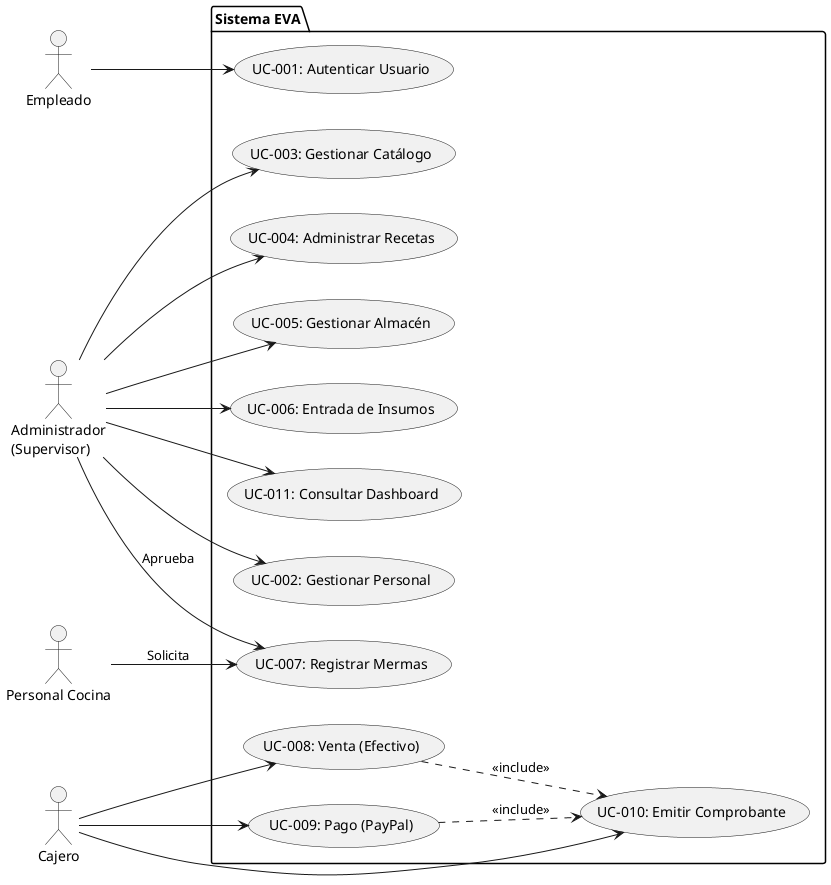

### 3.2. Vista Lógica
Representa la descomposición del sistema en capas lógicas de Frontend y Backend.

#### 3.2.1. Diagrama de Subsistemas (paquetes)
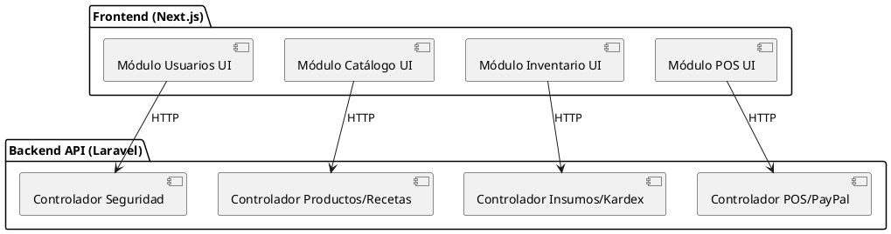

#### 3.2.2. Diagrama de Secuencia (vista de diseño)
*Escenario Principal del Negocio: UC-008: Registrar Venta de Productos (Efectivo)*
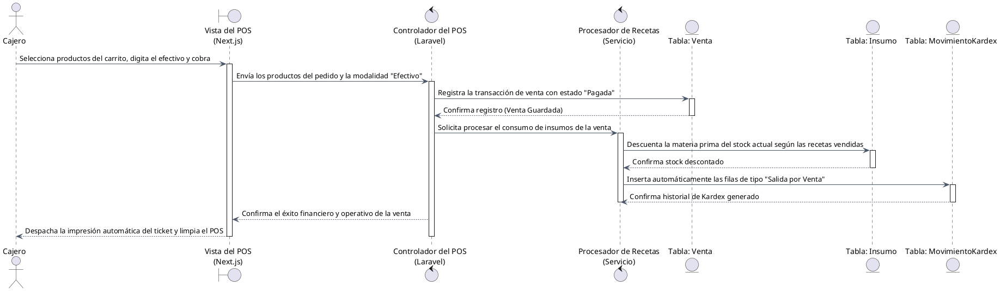

#### 3.2.3. Diagrama de Colaboración (vista de diseño)
*Escenario: Registrar Entrada de Insumos.*
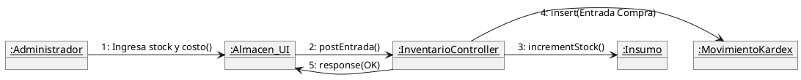

#### 3.2.4. Diagrama de Objetos
*Instancia de objetos durante una Merma Provisional.*
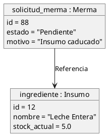

#### 3.2.5. Diagrama de Clases
*Modelo de Dominio y Entidades Principales.*
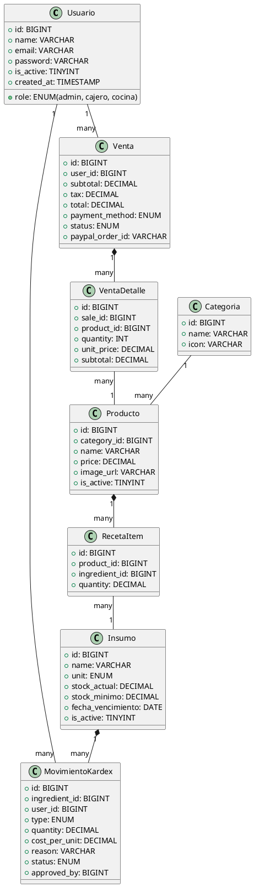

#### 3.2.6. Diagrama de Base de datos (relacional o no relacional)
*Modelo Físico de Datos (MariaDB - eva_cafeteria).*
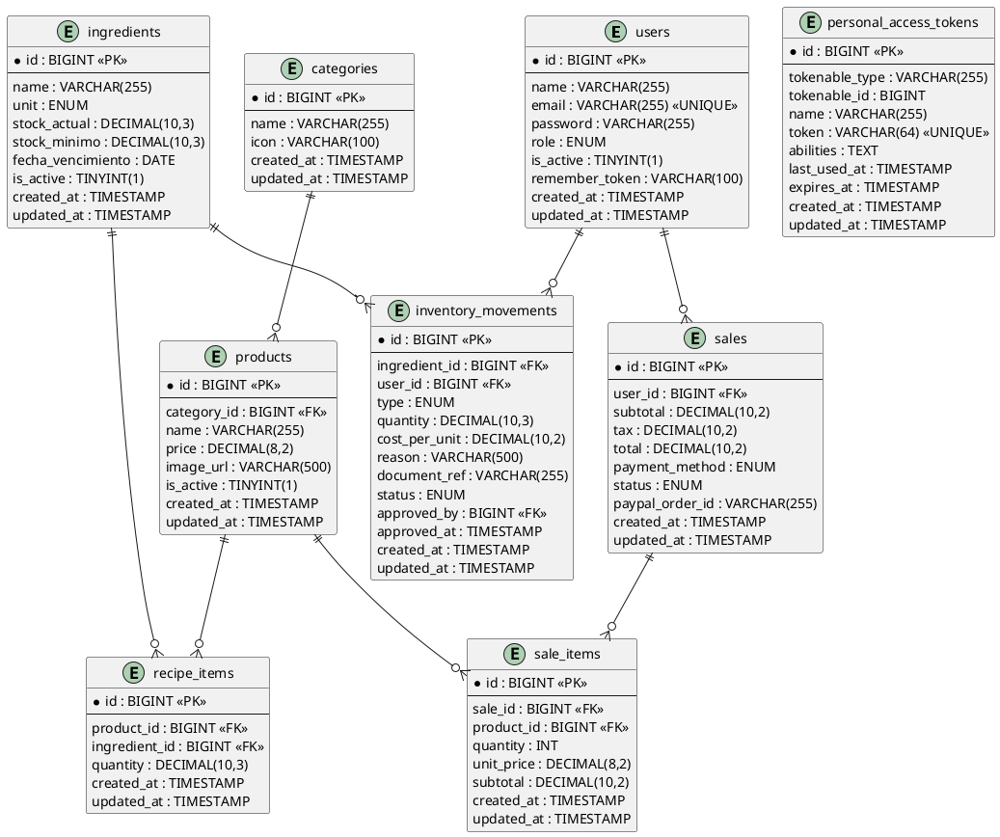

### 3.3. Vista de Implementación (vista de desarrollo)
#### 3.3.1. Diagrama de arquitectura software (paquetes)
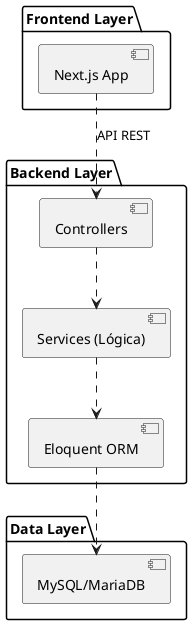

#### 3.3.2. Diagrama de arquitectura del sistema (Diagrama de componentes)
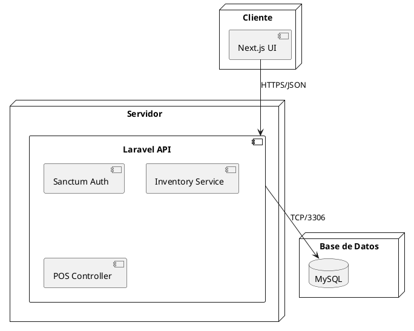

### 3.4. Vista de procesos
#### 3.4.1. Diagrama de Procesos del sistema (diagrama de actividad)
*Flujo del Inventario: Mermas vs Ventas.*
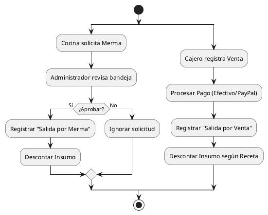

### 3.5. Vista de Despliegue (vista física)
#### 3.5.1. Diagrama de despliegue
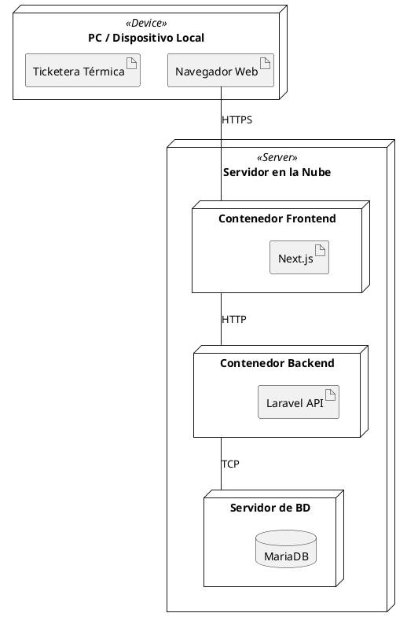

---

## 4. ATRIBUTOS DE CALIDAD DEL SOFTWARE

### Escenario de Funcionalidad
El sistema garantiza que todas las reglas de negocio críticas se cumplan en el backend. Por ejemplo, una venta o merma siempre registrará un asiento inmutable en el Kardex garantizando la trazabilidad exacta de por qué se disminuyó un stock.

### Escenario de Usabilidad
La interfaz ha sido diseñada para una fácil navegación y aprendizaje. Los módulos están estructurados limpiamente en Next.js, mostrando notificaciones inmediatas ante éxito o error (como "Usuario registrado correctamente" o credenciales inválidas).

### Escenario de Confiabilidad
Mecanismos estrictos implementados en Laravel controlan la transaccionalidad y seguridad. Las validaciones evitan, por ejemplo, que correos repetidos sean registrados, y el uso de Sanctum protege las rutas operativas contra accesos no autorizados.

### Escenario de Rendimiento
Diseñado con Controladores que procesan reglas lógicas mediante `Services` dedicados (ej. `Procesador de Recetas`), permitiendo una velocidad de cálculo de insumos óptima antes de cada cierre de venta, entregando tiempos de respuesta rápidos en el POS.

### Escenario de Mantenibilidad
Al ser un sistema rígidamente dividido entre la capa de presentación visual (Next.js) y la capa de control de datos (Laravel), futuras ampliaciones, como un nuevo proveedor de pago similar a PayPal, requieren solo actualizar el backend sin tocar el cliente visual.

### Otros Escenarios
**Performance:** El sistema minimiza la carga en el servidor haciendo que validaciones livianas de entrada ocurran primero en el cliente de React antes de llamar a Laravel, optimizando el ancho de banda y garantizando fluidez durante el registro de grandes volúmenes de ventas en efectivo.
